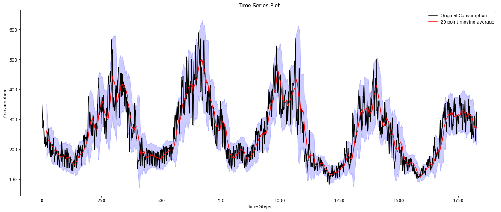
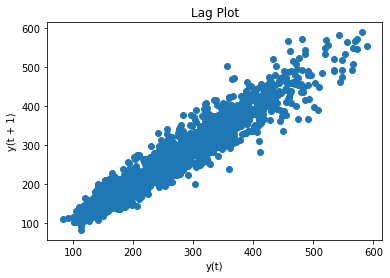
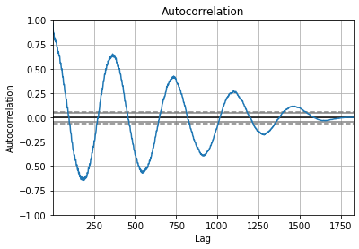
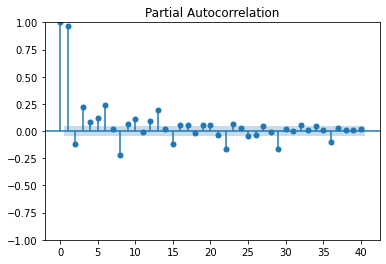
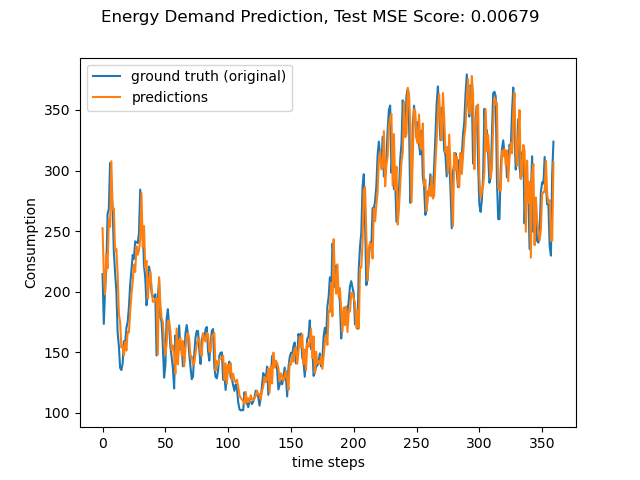
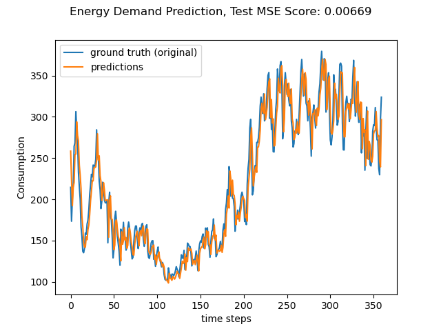
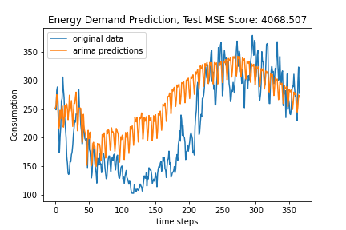

# Petroineos

This readme gives an overview of the two subtasks completed:
1. Energy Demand
2. Coin Machine

Each subtask has it's own respective folder by the same name, that contains the code written for completing this challenge.

## Energy Demand
All code for Energy Demand is in the following directory: `./Energy_Demand`
### Setup
To run the code for energy demand, we use deep learning modelling librariry [PyTorch](https://pytorch.org/) hence install the necessary requirements to run the file (ideally in virtual env):
``` python
pip install -r ./Energy_Demand/requirements.txt
```
### Instructions
Once all the requirements have been installed, you can run the code. The code for Energy Demand comprises of the following files:

1. `dataset_loader.py`: Which defines all the data pre-processing steps wrapped in a class, to create a dataset for training a model
2. `neural_network.py`: Defines the code for the 2 types of model we experiment with. I particularly experiment with two models: `LSTM` and `Multi Layer Perceptron`
3. `arguments.py`: Defines all the hyper parameters and other args to run the code
4. `main.py`: Defines functions for training, validation and testing the model and saving the weights
5. `DataExploration.ipynb`: is a jupyter notebook that explores the data, and runs a simple ARIMA model for forecasting

There are multiple arguments that can be edited either in the `./Energy_Demand/arguments.py` file, or simply via the terminal by using the relevant flag For example the type of model you want to train / test, can be selected by editing the model name arg i.e. `--model_name $model_name` where `$model_name` is a string option `"lstm"` or `"ffn"` to select the LSTM or Multi Layer Perceptron model respectively.

#### Training & Testing:
``` python
python ./Energy_Demand/src/main.py --train_test --device $device --model_name $model_name --batch_size $batch_size --data_path $data_path
```
Where the flag `train_test` specifies conducting all training, validation and testing. `--data_path` flag, requires the file path to the provided dataset `energy.dat`. `--device` flag allows you to select if you'd like to use the CPU or the GPU to train. If CPU is preferred the the arg should be a string `"cpu"` otherwise an int stating the GPU device id i.e. `1` if you'd like to use the primary GPU.

#### Training only:
If you'd like to perform training and validation only (i.e. no testing), then simply use the `--train` flag. The rest of the args can stay the same i.e.
``` python
python ./Energy_Demand/src/main.py --train ...
```
#### Testing only:
If you'd like to perform testing only, then simply use the `--test` flag. The rest of the args can stay the same i.e.
``` python
python ./Energy_Demand/src/main.py --test ...
```
### Data Exploration

Upon exploring the data, I realised since the data is almost periodic, a neural network should be able to model it pretty easily without the need of smoothing or any fancy processing. Furthermore the Lag plot shows a linear pattern within the data; hence even easier for a neural network to solve.

Hence, our main data processing steps are simple and as follows (implementation can be found in `dataset_loader.py`):

1. read the data frame
2. normalise it, within the range of -1 to 1 (helps with LSTM networks; since activation is TanH)
3. split into train, val and test splits
4. divide data into sequence windows (i.e. input sequences and corresponding output sequences). This allows easy batching for training

To understand the data, we create a **time seris plot (together with plotting a 20-point moving average)**


**Lag Plot**, to see the amount of randomness in the data. Which in the case below; exhibits a linear pattern which is simple to model;


**Autocorrelation Plot** to further verify the lack of randomness in data (perodic waves generated):


**Partial Autocorrelation plot**, this is to basically understand the args for the **ARIMA** model.


### Forecasting Results
As stated we experiment with the following methods:

1. ARIMA (the code for ARIMA can be found in the notebook: `DataExploration.ipynb`)
2. Multi Layer Perceptron
3. LSTM

For the neural network a sliding window approach was taken. Given an input sequence length of size `iS` (in my case, `iS = 5`) and the model is tasked to predict the next set of points of size output sequence length i.e. `oS` (in my case, `oS=1`). Making them autoregressive. The stride of the sliding window was 1. For example:
``` python
dataset = [1,2,3,4,5,6,7,8]
input_sequence=5
output_sequence=1
# Then the following data subset for input and output will be 
data_subset_1_input = [1,2,3,4,5]
data_subset_1_output = [6]
# where data_subset_1_output is the ground truth the model is trained to predict.

# similarly for stride 2 (i.e. subset 2) the window will shift by one point
data_subset_2_input = [2,3,4,5,6]
data_subset_2_output = [7]

# and so on.... till the model has trained with all the points
```
Furthermore, the data was split as follows: 70% training, 10% validation and 20% testing.

**Discussion of Results**: The following section showcases the forecasting results for each. As expected the **Multi Layer Perceptron Achieves the best results**, followed by LSTM and then ARIMA. As stated since, the data holds a linear correlation and is almost periodic, LSTM is a bit of an overkill and slow to train, hence Multi Layer Perceptron achieves good results within 160 epochs of training. It is possible LSTM may converge to the same result if trained for longer. ARIMA is the worse performing, however this can be improved via hyperparameters / pre-processing. Currently ARIMA uses 140 Lags, which is already over parameterised, however, using greater number of lags can certainly result in a better fit.

#### Multi Layer Perceptron Results

#### LSTM Results

#### ARIMA Results



## Coin Machine
To run the coin change code simply do the following:
``` python
python main ./Coin_Machine/main.py
```
Given there are 10 demoniations of coin values, the results take a long time to generate. Currently my code is based on Recursion.
I'd love to get feedback from the assessors to see, how this can be improved into terms of speed efficiency.